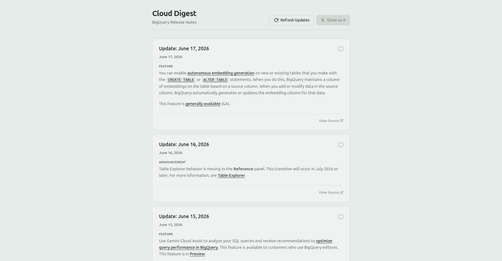
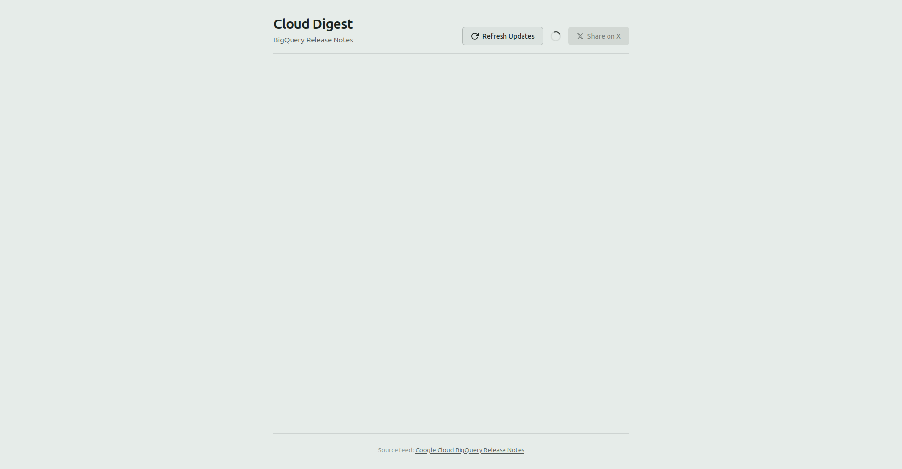
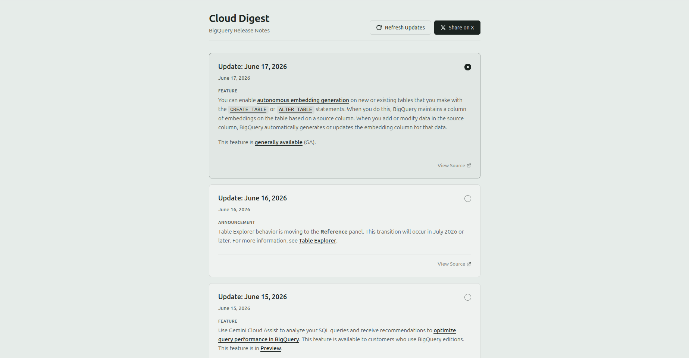

# Cloud Digest

Cloud Digest is a minimal, modern, editorial-style cloud update reader for Google Cloud BigQuery Release Notes.

This project was developed as part of the Kaggle 5-Day AI Agents: Intensive Vibe Coding Course With Google.

## Features
- **Feed Viewer**: Fetches and parses the official BigQuery release notes XML feed dynamically.
- **Minimal Editorial Design**: Follows a clean, SaaS-style Notion/Google Cloud Docs-inspired theme in a soft sage-gray/slate color scheme.
- **Refresh Mechanism**: Fetch the latest updates dynamically without reloading the page.
- **Share on X**: Single-select a release card and share it instantly on X/Twitter with pre-filled hashtags (`#BigQuery #GoogleCloud`) and deep links.

---

## Screenshots

### Home Feed View


### Refreshing Feed State


### Selected Card State


---


## Tech Stack
- **Backend**: Python Flask
- **Frontend**: Vanilla HTML, CSS, JavaScript (no external libraries or frameworks)

---

## Installation & Setup

1. Clone the repository:
   ```bash
   git clone git@github.com:Nataraj-EL/kaggle-cloud-release-digest.git
   cd kaggle-cloud-release-digest
   ```

2. Create a virtual environment:
   ```bash
   python3 -m venv venv
   source venv/bin/activate
   ```

3. Install the dependencies:
   ```bash
   pip install -r requirements.txt
   ```

4. Run the Flask application:
   ```bash
   python app.py
   ```

5. Open your browser and navigate to:
   ```text
   http://127.0.0.1:5000
   ```

---

## License
Licensed under the [MIT License](LICENSE).
